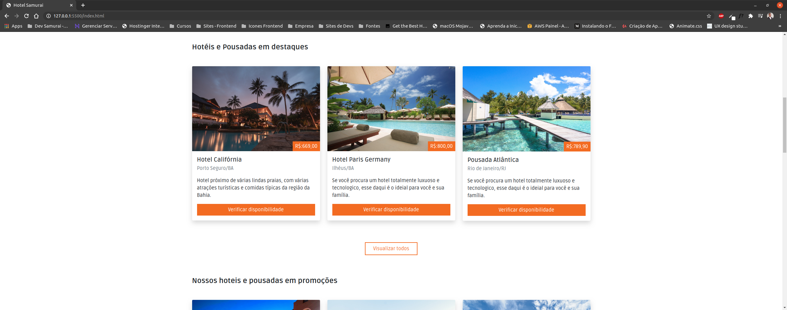

# Hotel Samurai

Olá, tudo bem?

Fico agradecido e feliz por você está por aqui vendo um dos meus projetos.

Segue abaixo mais detalhes do mesmo.

## Sobre o projeto

Esse é um projeto desenvolvido no curso de Front end Master da Dev Samurai.

A ideia do projeto é de desenvolver uma aplicação (template) totalmente focada em empresas de turismos, ou seja, que forneçam opções de hospedagem para o usuário final.

Nessa aplicação o foco é abordar conceitos de front end usando bootstrap então as páginas são estáticas sem envolvimento com back end ou uso de javascript. 

As tecnologias que estão sendo usadas neste projeto são:

1. Bootstrap (V5).
2. CSS.
3. JavaScript.

Segue abaixo alguns screenshots do projeto:

## Professor

Carlos Eduardo

Website: [https://carloseduardo.dev](https://carloseduardo.dev)
